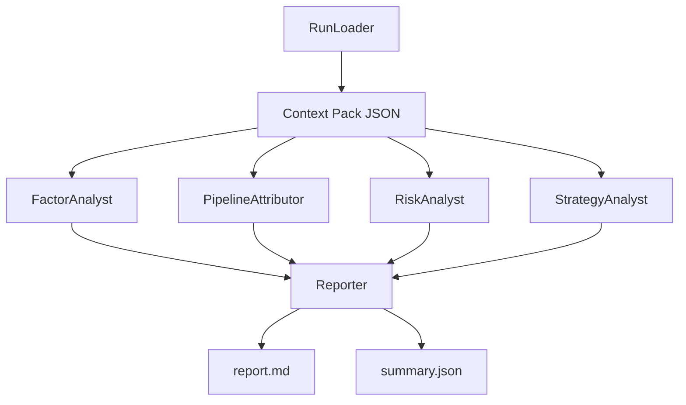

# Backtest + Attribution Analyst Agent Spec (OpenAI-Based)

This document describes what an agent framework should do to analyze this repo's backtest results, attribution outputs, factor-analysis outputs, and risk-module outputs, and how to structure prompts so a model can produce reliable, attributable conclusions.

The goal is: given one `out_dir` produced by [`main()`](scripts/etf_weekly_factor_bt.py:305), the agent generates:

- a human report (markdown)
- a machine summary (JSON) that can be fed into a second-pass LLM summarizer
- a list of next experiments with clear hypotheses and success criteria

## 1) Inputs: What The Agent Must Read

### 1.1 Backtest run outputs

Assume the run directory contains (example):

- run manifest: [`run_manifest.json`](results/etf_weekly_smoke/run_manifest.json:1)
- strategy metrics: [`metrics.json`](results/etf_weekly_smoke/metrics.json:1)
- strategy returns/equity: [`returns.csv`](results/etf_weekly_smoke/returns.csv:1), [`equity_curve.csv`](results/etf_weekly_smoke/equity_curve.csv:1)
- holdings snapshots: [`positions.csv`](results/etf_weekly_smoke/positions.csv:1)
- selected targets (pre/post risk overlay): [`targets_pre_risk.csv`](results/etf_weekly_smoke/targets_pre_risk.csv:1), [`targets_post_trend.csv`](results/etf_weekly_smoke/targets_post_trend.csv:1), legacy [`targets.csv`](results/etf_weekly_smoke/targets.csv:1)
- benchmark + excess: [`benchmark_returns.csv`](results/etf_weekly_smoke/benchmark_returns.csv:1), [`excess_vs_510300.SH.csv`](results/etf_weekly_smoke/excess_vs_510300.SH.csv:1), [`excess_vs_510500.SH.csv`](results/etf_weekly_smoke/excess_vs_510500.SH.csv:1)
- optional HTML report: [`quantstats_report.html`](results/etf_weekly_smoke/quantstats_report.html:1)

### 1.2 Attribution outputs (selection / filtering / pipeline)

- cross-section table for each rebalance date: [`attribution/rebalance_cross_section.csv`](results/etf_weekly_smoke/attribution/rebalance_cross_section.csv:1)
- pipeline summary table: [`attribution/pipeline_summary.csv`](results/etf_weekly_smoke/attribution/pipeline_summary.csv:1)

These outputs come from selection logic in [`select_targets_by_date()`](qlib_bt/selection.py:11) and exports done in [`main()`](scripts/etf_weekly_factor_bt.py:305).

### 1.3 Risk-module outputs

There are two risk layers:

- trend filter (benchmark MA regime) applied before trading, implemented in [`_trend_scale_by_day()`](scripts/etf_weekly_factor_bt.py:134)
- stop-loss executed in Backtrader, implemented in [`run_backtrader()`](qlib_bt/bt_engine.py:79)

Risk artifacts:

- stop-loss events: [`stop_loss_events.csv`](results/etf_weekly_smoke/stop_loss_events.csv:1)
- pre-risk backtest folder: [`bt_pre_risk/returns.csv`](results/etf_weekly_smoke/bt_pre_risk/returns.csv:1) and [`bt_pre_risk/summary.txt`](results/etf_weekly_smoke/bt_pre_risk/summary.txt:1)

### 1.4 Factor analysis outputs

Factor analysis is exported by [`export_factor_analysis_inputs()`](qlib_bt/factor_analysis_integration.py:96) and analyzed by [`main()`](scripts/factor_analysis_runner.py:27).

Typical directory:

- exported inputs: [`factor_analysis/meta.json`](results/etf_weekly_smoke/factor_analysis/meta.json:1), [`factor_analysis/ret.parquet`](results/etf_weekly_smoke/factor_analysis/ret.parquet:1)
- validation diagnostics: [`factor_analysis/validation.json`](results/etf_weekly_smoke/factor_analysis/validation.json:1)
- per-signal analysis folder: e.g. [`factor_analysis/signal=score/metrics.json`](results/etf_weekly_smoke/factor_analysis/signal=score/metrics.json:1) plus PNG charts.

The numeric metrics are computed using logic consistent with [`SignalAnalyzer.ic_analysis()`](factor_analysis/signal_analyzer.py:148), [`SignalAnalyzer.return_analysis()`](factor_analysis/signal_analyzer.py:253), and [`SignalAnalyzer.turnover_analysis()`](factor_analysis/signal_analyzer.py:328).

## 2) Agent Responsibilities (What It Should Do)

Think of the agent as producing an "audit trail": every conclusion should point back to a specific artifact and metric.

### 2.1 Sanity checks (fast fail)

The agent should immediately validate:

- run metadata consistency: read [`run_manifest.json`](results/etf_weekly_smoke/run_manifest.json:1) and confirm date range, params, benchmark list, and output file presence.
- time index alignment:
  - `returns.csv` vs `benchmark_returns.csv`
  - `targets_post_trend.csv` rebalance dates vs `attribution/pipeline_summary.csv`
- basic data quality flags:
  - missingness, duplicates, empty windows
  - unusually small universe/eligible count spikes (from [`pipeline_summary.csv`](results/etf_weekly_smoke/attribution/pipeline_summary.csv:1))

If any fail, report should be "inconclusive" and list missing artifacts.

### 2.2 Performance summary (strategy vs baseline vs benchmark)

Compute and report for both:

- pre-risk run: `out_dir/bt_pre_risk/`
- post-risk run: `out_dir/`

Metrics to compute:

- total return, annualized return, annualized vol, Sharpe
- max drawdown (already provided by Backtrader)
- turnover (weekly avg) from `targets_*.csv`
- excess return time series vs each benchmark

The post-risk vs pre-risk delta is itself a first-order attribution: it tells you whether the risk module is adding value or just reducing exposure.

### 2.3 Attribution from the selection pipeline (explain "where did the strategy come from")

Using [`rebalance_cross_section.csv`](results/etf_weekly_smoke/attribution/rebalance_cross_section.csv:1) and [`pipeline_summary.csv`](results/etf_weekly_smoke/attribution/pipeline_summary.csv:1):

- Coverage diagnostics:
  - universe size and eligible size over time
  - reasons for ineligibility: liquidity filter vs tradability filter
- Selection diagnostics:
  - distribution of `score` among eligible vs picked
  - rank stability: how often top names repeat (persistence)
- Concentration diagnostics:
  - effective number of positions (ENP) per rebalance
  - max weight (should be 1/N scaled by trend exposure)

Deliverable: a clear statement like:

- "Most weeks eligible size collapses because liquidity filter binds" OR
- "Score separation between picked and non-picked is weak" OR
- "Turnover spikes on specific weeks and drives cost drag"

### 2.4 Risk attribution (trend + stop-loss)

#### Trend filter attribution

Inputs:

- `targets_pre_risk.csv` vs `targets_post_trend.csv`
- trend scale statistics already in [`metrics.json`](results/etf_weekly_smoke/metrics.json:1)

Analyses:

- average and min exposure scale
- how often risk-off is triggered and in which market regimes
- correlation of exposure scale with benchmark returns

Interpretation targets:

- good: risk-off reduces drawdown in bad regimes and preserves upside
- bad: risk-off triggers during recoveries and kills returns

#### Stop-loss attribution

Inputs:

- [`stop_loss_events.csv`](results/etf_weekly_smoke/stop_loss_events.csv:1)
- `positions.csv` and `returns.csv`

Analyses:

- frequency: events per month
- clustering: do stop-losses cluster in volatility spikes?
- outcome: after a stop-loss, what happened to that instrument next (rebound vs continued decline)
- interaction with weekly rebalance: does stop-loss fight the selection signal?

### 2.5 Factor signal diagnosis (what part is alpha vs noise)

For each signal `signal=<name>` (e.g. mom20, rev5, score):

Read [`metrics.json`](results/etf_weekly_smoke/factor_analysis/signal=score/metrics.json:1) and extract:

- IC: mean/std/IR and positive rate
- quantile spread: top minus bottom daily stats
- turnover proxy: top_group_avg
- data quality: null_rate, codes, dates

Then produce:

- ranking of signals by "robustness" (IC stability, spread consistency, turnover acceptability)
- note redundancy: if two signals behave the same, treat as one degree of freedom

Important: do not optimize weights until you can explain which signal is stable and why.

## 3) Prompting Strategy (How To Make The LLM Behave)

### 3.1 Avoid giving raw tables to the model

CSV tables can be huge. Instead, the agent should run a local "preprocessor" that produces a compact Context Pack JSON.

The LLM should see:

- key scalars
- a few small sampled rows (for anomaly illustration)
- time-series aggregates (rolling stats, quantiles)
- a strict schema

### 3.2 Force explicit evidence and citations

The prompt should require the model to cite which artifact each claim comes from.

Example rule:

- Every conclusion must include `source: <file>.<field>`.

Where `<file>` must match one of the artifacts listed in Section 1.

### 3.3 Use a fixed analysis rubric

Suggested rubric (the model must fill every section):

1) Data sanity and coverage
2) Performance: pre-risk vs post-risk vs benchmark
3) Pipeline attribution: filters, selection, turnover
4) Factor diagnosis: IC, spread, turnover
5) Risk diagnosis: trend, stop-loss, interactions
6) Hypotheses and next experiments (max 5)
7) Red flags and anti-overfit notes

### 3.4 Constrain recommendations into experiments

A recommendation must be expressed as:

- change
- hypothesis
- expected direction of change in specific metrics
- what to hold constant
- what to compare (A/B)

This prevents "hand-wavy" advice.

## 4) Agent Architecture (Suggested)

A practical architecture is a small multi-agent system with a single orchestrator.

### 4.1 Components

- RunLoader: loads `run_manifest.json`, enumerates artifacts, does alignment checks.
- StrategyAnalyst: computes pre/post performance metrics, benchmark/excess summaries.
- PipelineAttributor: analyzes selection pipeline tables.
- RiskAnalyst: analyzes trend exposure and stop-loss events.
- FactorAnalyst: aggregates per-signal `metrics.json` and ranks signals.
- Reporter: composes final markdown report + compact JSON summary.

### 4.2 Dataflow



## 5) Context Pack: What To Give The LLM

### 5.1 Suggested schema

Write one file per run, for example `out_dir/llm_context_pack.json`.

Minimum fields:

```json
{
  "schema_version": 1,
  "run": {
    "out_dir": "results/etf_weekly_smoke",
    "git_head": "...",
    "start": "2025-01-02",
    "end": "2025-03-31"
  },
  "strategy": {
    "pre_risk": {"ann_return": null, "ann_vol": null, "sharpe": null, "max_drawdown": null},
    "post_risk": {"ann_return": null, "ann_vol": null, "sharpe": null, "max_drawdown": null},
    "delta": {"delta_ann_return": null, "delta_max_drawdown": null}
  },
  "benchmarks": {
    "list": ["510300.SH", "510500.SH"],
    "excess": {"510300.SH": {"ann_return": null}, "510500.SH": {"ann_return": null}}
  },
  "pipeline": {
    "coverage": {"universe_mean": null, "eligible_mean": null},
    "filters": {"liquidity_bind_rate": null, "tradable_bind_rate": null},
    "turnover": {"weekly_avg_pre_risk": null, "weekly_avg_post_trend": null}
  },
  "risk": {
    "trend": {"ma": 20, "risk_off_scale": 0.3, "trigger_rate": null},
    "stop_loss": {"threshold": 0.10, "events": {"count": 0, "sample": []}}
  },
  "factors": {
    "signals": [
      {"name": "score", "ic_ir": null, "ic_mean": null, "spread_ir": null, "turnover": null}
    ]
  },
  "artifacts": {
    "metrics": "results/etf_weekly_smoke/metrics.json",
    "manifest": "results/etf_weekly_smoke/run_manifest.json"
  }
}
```

The agent creates this JSON by reading:

- strategy metrics from [`metrics.json`](results/etf_weekly_smoke/metrics.json:1)
- factor metrics from per-signal [`metrics.json`](results/etf_weekly_smoke/factor_analysis/signal=score/metrics.json:1)
- pipeline stats from [`pipeline_summary.csv`](results/etf_weekly_smoke/attribution/pipeline_summary.csv:1)
- risk events from [`stop_loss_events.csv`](results/etf_weekly_smoke/stop_loss_events.csv:1)

### 5.2 Token budgeting

The Context Pack should be < 50KB if possible. If larger:

- store only aggregates, not full daily series
- store sampled rows (top 20 events / worst 10 drawdown days)

## 6) Prompts: What To Ask The Model To Produce

The model output should be deterministic in structure.

### 6.1 Report prompt outline

System: "You are a quantitative research auditor. Only make claims supported by provided data. If data is missing, say so."

User content:

- Context Pack JSON
- requested output format

Required output (markdown):

- Executive summary (3 bullets)
- What changed: pre-risk vs post-risk (trend + stop-loss)
- Factor quality ranking (table)
- Pipeline attribution findings
- Risk module findings
- Benchmark comparison
- Actionable next experiments (max 5)

### 6.2 JSON summary prompt

Ask the model to produce a strict JSON object matching a schema.

This enables a second-pass LLM to generate narrative summaries without re-reading raw data.

## 7) What "Good" Looks Like For This Agent

- It never hallucinates file content: it reads artifacts and summarizes.
- It explicitly separates:
  - signal quality vs portfolio construction vs trading execution
  - pre-risk vs post-risk performance
- It outputs next steps as testable experiments, not generic advice.

## 8) Notes Specific To This Repo

- Strategy selection pipeline is defined in [`select_targets_by_date()`](qlib_bt/selection.py:11) and factors in [`build_minimal_factors()`](qlib_bt/factors.py:12).
- Backtrader execution and stop-loss logic are in [`run_backtrader()`](qlib_bt/bt_engine.py:79).
- Factor analysis runner exports numeric per-signal metrics in [`main()`](scripts/factor_analysis_runner.py:27).

If later you add more risk modules (vol targeting, max drawdown guard, dynamic rebalance), keep the same pattern:

- export pre-risk and post-risk targets
- log risk events
- run A/B backtests
- write deltas into `metrics.json`

That is what makes the end-to-end process attributable.
